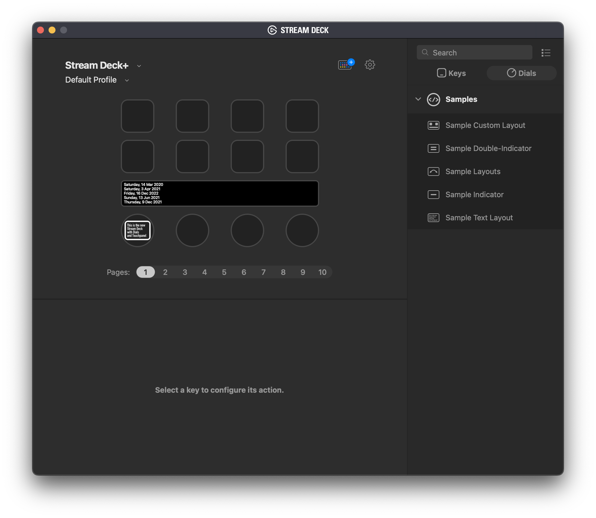

# A Sample Text Layout Stream Deck Plugin

This is a StreamDeck + sample plugin that demonstrates how to create a list of string as a `layout` shown on Stream Deck's touch-panel.



```
{
    "id": "com.elgato.sample-textlayout.action.layout",
    "items": [
        {
            "key": "customtext0",
            "type": "text",
            "font": { "size": 16, "weight": 500 },
            "rect": [8, 4, 192, 17],
            "alignment": "left",
            "z-order": 5
          },
          {
            "key": "customtext1",
            "type": "text",
            "rect": [8, 22, 192, 17],
            "font": { "size": 16, "weight": 500 },
            "alignment":"left"
          },
          {
            "key": "customtext2",
            "type": "text",
            "rect": [8, 40, 192, 17],
            "font": { "size": 16, "weight": 500 },
            "value": "Next line",
            "alignment":"left"
          },
          {
            "key": "customtext3",
            "type": "text",
            "rect": [8, 58, 192, 17],
            "font": { "size": 16, "weight": 500 },
            "value": "Next line2",
            "alignment":"left"
          },
          {
            "key": "customtext4",
            "type": "text",
            "rect": [8, 76, 192, 17],
            "font": { "size": 16, "weight": 500 },
            "value": "Next line 3",
            "alignment":"left"
          }
       
    ]
}
```

